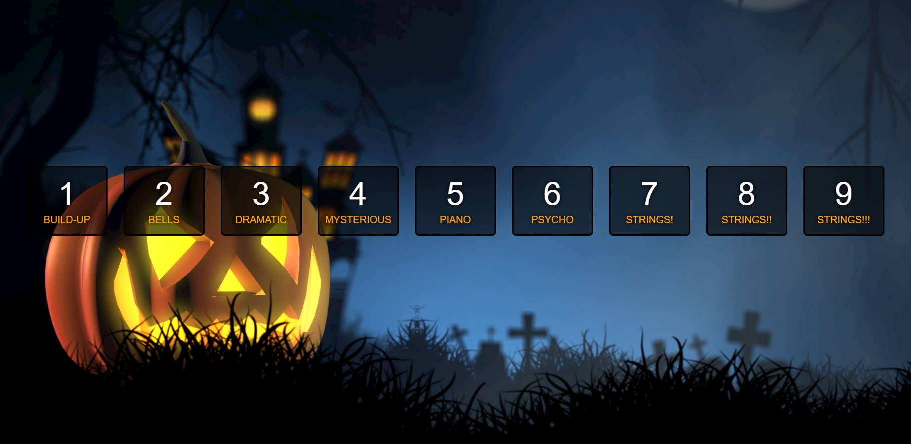

# spooky-music-soundboard

## Description
This is a simple spooky music soundboard.

The page has a background image and nine divs that can be triggered using the keyCode for 1-9 and by click. When clicked, the audio will begin, along with a transition effect in the form of a transform and change in border color. It is also responsive.

It is deployed at: https://spencerhulse.github.io/spooky-music-soundboard/